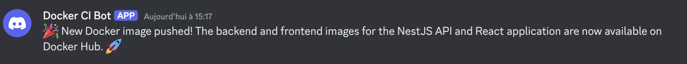

### Exercice MNS M2I

### Setup

- Lancer le projet `docker compose up --build`

### Endpoints
- Frontend (React) : http://localhost:5173
- Backend (NestJS) : http://localhost:3000

### Logs

- Pour voir les logs: `docker exec -it demo_nestjs_api_vehicle cat /var/log/nestjs/app.log`
- Pour suivre les logs en temps reel: `docker exec -it demo_nestjs_api_vehicle tail -f /var/log/nestjs/app.log`

### Docker Hub
- https://hub.docker.com/repository/docker/theosementa0/demo-nestjs-api-vehicle/general 
- https://hub.docker.com/repository/docker/theosementa0/demo-react-frontend/general

### Workflow

